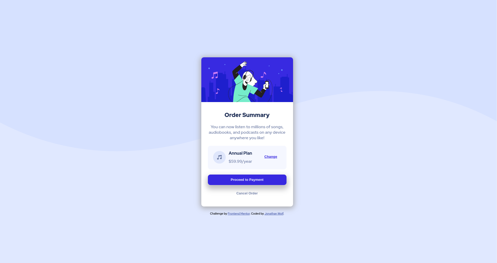

# Frontend Mentor - Order summary card solution

This is a solution to the [Order summary card challenge on Frontend Mentor](https://www.frontendmentor.io/challenges/order-summary-component-QlPmajDUj). Frontend Mentor challenges help you improve your coding skills by building realistic projects. 

## Table of contents

- [Overview](#overview)
  - [The challenge](#the-challenge)
  - [Screenshot](#screenshot)
  - [Links](#links)
- [My process](#my-process)
  - [Built with](#built-with)
  - [What I learned](#what-i-learned)
  - [Continued development](#continued-development)
  - [Useful resources](#useful-resources)
- [Author](#author)
- [Acknowledgments](#acknowledgments)

**Note: Delete this note and update the table of contents based on what sections you keep.**

## Overview

### The challenge

Users should be able to:

- See hover states for interactive elements

### Screenshot



### Links

- [code](https://github.com/jwolf9/order-summary-component-main)
- [live site](https://jwolf9.github.io/order-summary-component-main/)

## My process

### Built with

- CSS
- HTML
- Sass
- Flexbox

### What I learned

I learned how to format background images. How to make the image not repeat and add colors for a filtered effect

```html
<h1>Some HTML code I'm proud of</h1>
```
```css
body {
  background-image: url(../images/pattern-background-desktop.svg);
  background-color: $pale-blue;
  background-repeat: no-repeat;
  background-size: 100%;
}
```

### Continued development

Want to get more comfortable with the Flexbox model and positioning elements

## Author

- Frontend Mentor - [@jwolf9](https://www.frontendmentor.io/profile/jwolf9)
